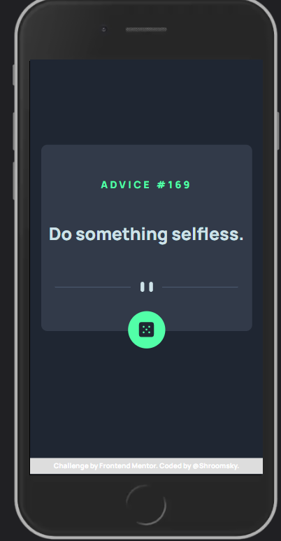
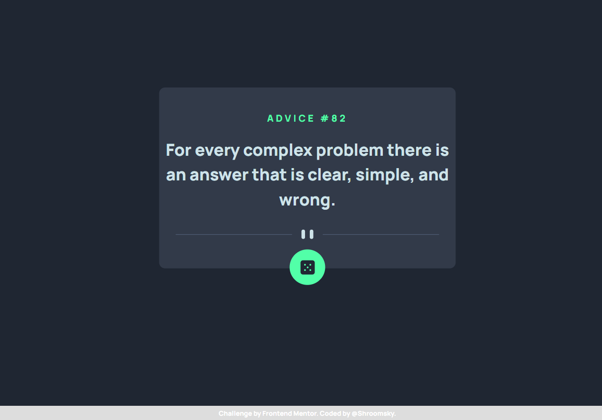

# Frontend Mentor - Advice generator app solution

This is a solution to the [Advice generator app challenge on Frontend Mentor](https://www.frontendmentor.io/challenges/advice-generator-app-QdUG-13db). Frontend Mentor challenges help you improve your coding skills by building realistic projects.

## Table of contents

- [Overview](#overview)
  - [The challenge](#the-challenge)
  - [Screenshot](#screenshot)
  - [Links](#links)
  - [Built with](#built-with)
  - [What I learned](#what-i-learned)
  - [Useful resources](#useful-resources)
- [Author](#author)

## Overview

### The challenge

Users should be able to:

- View the optimal layout for the app depending on their device's screen size
- See hover states for all interactive elements on the page
- Generate a new piece of advice by clicking the dice icon

### Screenshot

### Links

- Solution URL: [Advice-Generator-App](https://advice-generator-slip-api.netlify.app/)

## My process

### Built with

- Semantic HTML5 markup
- CSS custom properties
- Flexbox
- Sass
- JS

### What I learned

In this challenge, I practiced using the Fetch API and how to use the returned data.

### Useful resources

- [MDN Fech API](https://developer.mozilla.org/en-US/docs/Web/API/Fetch_API) - This helped me for understanding how to use Fech.

## Author

- Frontend Mentor - [@Shroomsky](https://www.frontendmentor.io/profile/Shroomsky)
